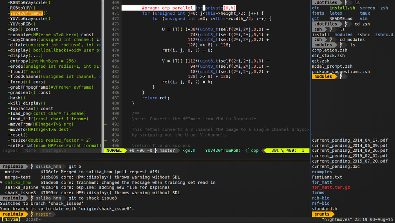

# Shackleford's dotfiles

# Have you ever taken one of Dr. Shackleford's classes and asked "Gee I sure with those insane dotfiles of his would work on my shiny chunk of fruity alumunium!"?

Behold! I have the solution.

## The OSXening

While these dotfiles were originally intended for use with an Ubuntu machine, Apple's recent move to using zsh as their
primary terminal shell has made them viable on OSX systems with a few tweaks. This repo will enable to you reap all the 
benefits of the legendary dotfiles now on your favorite poorly cooled, propriatry aluminium fruit machine.

## What changes were made?

None as of yet, but there is a guide to help get you up and running.

A proper modification to the existing install script is in the works, which includes:

- Support for brew, in place of apt-get.
- Support for Macvim in place of Apple's packed-in copy of Vim, which lacks python3 support.
- A working YouCompleteMe's install because it doesn't "Just Work" on OSX.

## Install(OSX)

### Setup Homebrew
Install [Homebrew](https://brew.sh)
Using Homebrew, install the following:
- cmake
- macvim
- mutt
- guile
- tmux
- gnupg
- screen <- Should already be installed by default
- neovim <- Not needed unless you want it

### Config git
Edit the `gitconfig` in the `git/` to properly reflect your credentials and not Shack's.

### Install the dotfiles
Run the `install.sh` script in the root directory like normal. It will complete with 5 failures because all of the "apt-get" statements will fail.

### Fix what's broken
Set Terminal's font to "DejaVu Sans Mono for Powerline 11". This will fix any font issues that appear as a result of not using the font these dotfiles were designed for

Add `alias vim='mvim -v'` to your `~/.zshrc` file. This will fix OSX forcing a broken version of Vim on you.

Run the `install.py` script found in the `~/.vim/plugged/YouCompleteMe/` directory. This will fix the ycmd server SHUT DOWN.

## Install(Linux, in case it was blatantly obvious)

Clone this or Shack's original repo and run the `install.sh` script in the root directory.

## Closing Remarks

Thank you for putting these dotfiles out there Dr.Shackleford. 

